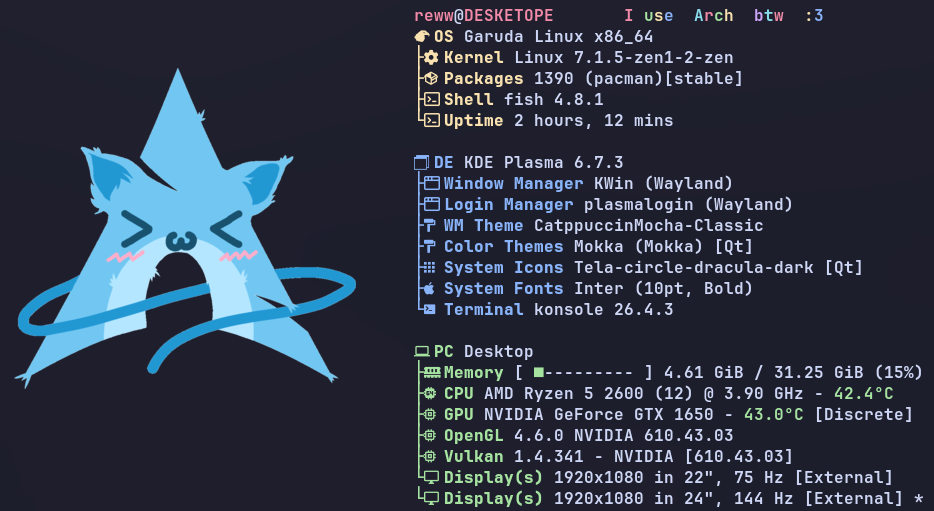
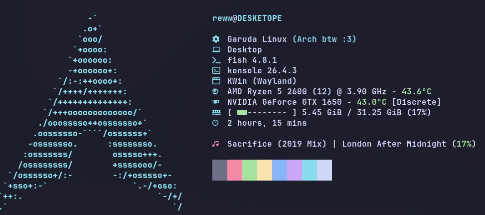

 
# Fastfetch

</h3 align="left">
This is my own fastfetch configs repo. Hi !
</h3>

I wanted to store my presets somewhere so here they are. I made them for my [Garuda Linux](https://garudalinux.org/) ricing (based on [Arch](https://wiki.archlinux.org/title/Main_page), I'm larping). Feel free to copy and modify them or clone the repository.
<br> 

<small>_(As you can see i'm not a pro just tried to add some previews LMAO)_</small>

<p align="center">
  
  &nbsp; &nbsp; &nbsp;
  
</p>
<p align="center">
  <small><em>Full config</em></small>
  &nbsp; &nbsp; &nbsp; &nbsp; &nbsp; &nbsp; &nbsp; &nbsp;
  <small><em>Lite config</em></small>
</p>

## Installation

Install [Fastfetch](https://github.com/fastfetch-cli/fastfetch) + Requires a [Nerd Font](https://www.nerdfonts.com/) [(Github link)](https://github.com/ryanoasis/nerd-fonts) for icons.

Clone the repository in an empty ``~/.config/fastfetch``

```
 git clone https://github.com/Reww666/arch-fastfetch.git ~/.config/fastfetch
```


Then execute your preferred config (``full``, ``lite``... and maybe more) with 

```
 fastfetch --config lite
 fastfetch --config full
```
OR

Copy the config you want, rename it to ``config.jsonc`` (still inside ``~/.config/fastfetch``) and execute it directly with

```
 fastfetch
```


> [!NOTE]
> _Feel free to add to the png folder._
> _To display images in `*.png` format, set_:
>
> ```
> sudo pacman -Syu imagemagick
> ```
> _Otherwise, Fastfetch will fallback to a text logo (or nothing)_


## Customize

Edit the different configs ``~/.config/fastfetch/(the config .jsonc)`` — See [Fastfetch documentation](https://github.com/fastfetch-cli/fastfetch/wiki/Configuration) for options.
